# Grafo de Ações, Eventos e Cadeias de Impacto da Simulação

Este documento mapeia como intenções individuais dos agentes viram eventos e como esses eventos alimentam cadeias físicas, econômicas, psicológicas, sociais, políticas, territoriais e militares na vila.

Regra central de arquitetura: o LLM escolhe intenções individuais e interpreta subjetivamente o contexto; o motor determinístico aplica causalidade sistêmica, valida regras do mundo e persiste consequências.

---

## 1. Visão Geral Dos Ciclos Interdependentes

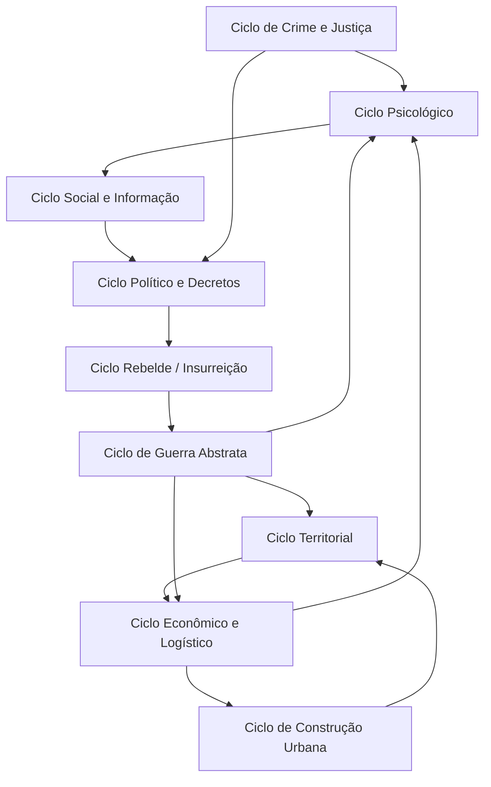

Principais estruturas atuais:

| Domínio | Estruturas centrais |
| :--- | :--- |
| Agentes | `AgentProfile`, `AgentState`, `AgentMemory`, `AgentRelation`, `AgentIntent` |
| Espaço | `SpatialSnapshot`, `TileCoord`, `BuildingSpec`, `RoomSpec`, `FixtureSpec`, `Territory` |
| Economia | `EconomyCatalog`, `HouseholdEconomy`, `EstablishmentEconomy`, `EconomicTask`, `VillageEconomy` |
| Política | `PoliticalIssue`, `PoliticalFaction`, `PoliticalPressure`, `PolicyAct`, `LocalNorms` |
| Justiça | `CrimeCase`, `CrimeType`, `SentenceKind`, `InjuryState`, `AgentLifeStatus` |
| Guerra | `Polity`, `ForeignRelation`, `WarState`, `WarStage`, `WarStatus` |
| Insurreição | `InsurrectionState`, `InsurrectionStage`, `InsurrectionStatus`, `FactionObjective` |

---

## 2. Ciclo Econômico: Produção, Consumo, Escassez e Logística

O ciclo econômico é material: itens existem em estoques, agentes carregam recursos, tarefas logísticas atravessam o grid, e consumo depende de despensa/reserva alimentar.

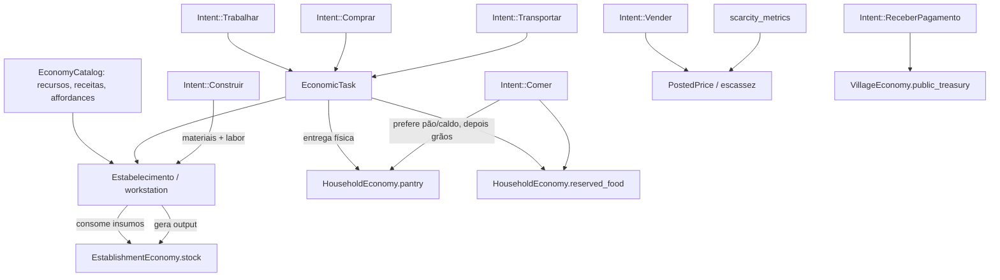

Expansões de profundidade sistêmica:

- A guerra deve aumentar demanda de `graos`, `ferramentas`, `metal_bruto`, `madeira` e `pedra`, criando escassez real.
- A escassez deve alimentar `PoliticalPressure`, não apenas preço.
- A logística deve carregar significado político: rotas inseguras, bloqueios, saque, confisco e abastecimento militar.
- O catálogo deve continuar sendo a fonte operacional para affordances: comida, combustível, ferramenta, material de construção, arma improvisada e bem comercial.

---

## 3. Ciclo Psicológico: Trauma, Tensão Interna e Coping

O ciclo psicológico não deve ser apenas `stress`. Ele deve explicar por que dois agentes submetidos ao mesmo evento reagem de forma diferente.

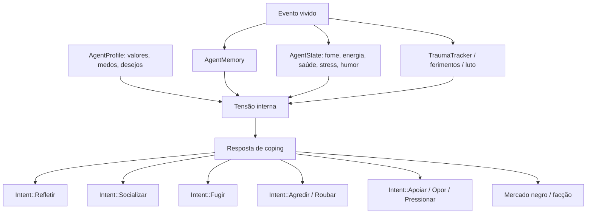

Estados psicológicos que devem aparecer em memórias e contexto LLM:

| Pressão | Possíveis efeitos subjetivos |
| :--- | :--- |
| Guerra | medo, orgulho, luto, desejo de vingança, lealdade ao grupo |
| Fome | humilhação, desespero, ressentimento distributivo |
| Punição | medo da lei, vergonha, ódio ao guarda/líder |
| Decreto opressivo | perda de legitimidade percebida, conspiração, obediência por medo |
| Promessa quebrada | traição, dívida moral invertida, queda de confiança |
| Vitória coletiva | orgulho faccional, esperança política, reputação de coragem |

Expansões de profundidade psicológica:

- `apply_edict_psychological_resistance` deve ser documentado como parte de legitimidade percebida, não só stress.
- Memórias relevantes devem diferenciar fato vivido, rumor ouvido, trauma, vergonha, luto, orgulho de grupo, dívida moral e promessa quebrada.
- `agent_chaos_pressure` deve ser entendido como agregador de fome, stress, trauma, ressentimento, ferimentos, pobreza e exposição à guerra.

---

## 4. Ciclo Social e De Informação

Conversas são turnos entre mentes separadas. Cada fala atualiza contexto subjetivo do falante, não simula os dois lados em uma única chamada.

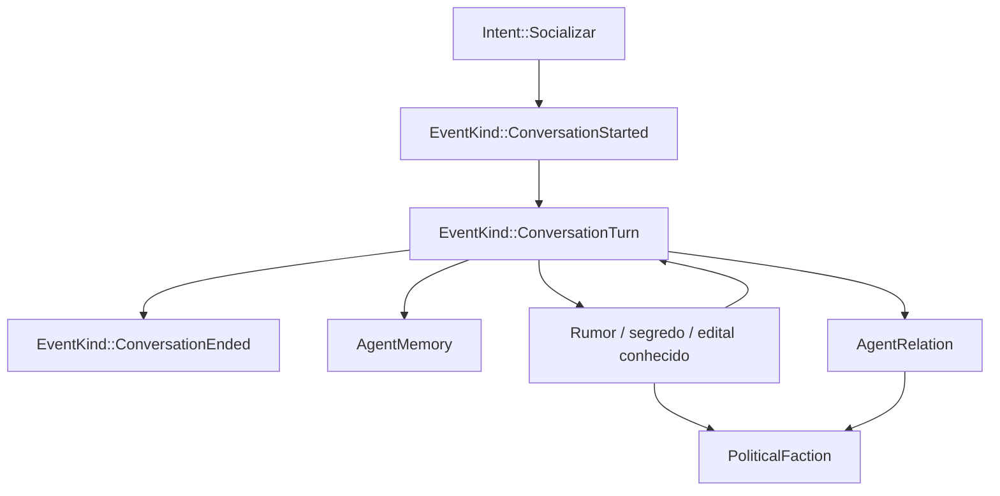

Expansões sistêmicas:

- Rumores de guerra, decreto, crime, fome e derrota devem ter peso político diferente.
- Informação falsa ou incompleta deve afetar acusações, pânico, facções e mercado negro.
- Guardas e líder devem ter maior alcance institucional, mas não conhecimento onisciente.
- A fofoca deve ser uma ponte entre psicologia individual e coordenação coletiva.

---

## 5. Ciclo de Crime, Evidência e Justiça

Crime e violência são materiais: recursos são transferidos, ferimentos alteram saúde, testemunhas/evidências criam casos.

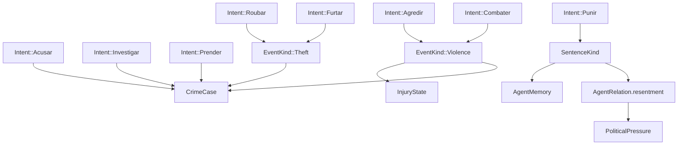

Expansões de profundidade:

- Punição severa deve aumentar obediência por medo, mas corroer legitimidade.
- Punição percebida como injusta deve alimentar `justica_vigilante`, `depor_lider` e insurreição.
- Testemunhar violência deve gerar trauma e mudar relações com agressor, vítima e autoridade.
- Guerra deve alterar legalidade percebida da violência: combate em guerra não é igual a crime comum, mas ainda pode gerar trauma e ressentimento.

---

## 6. Ciclo Político: Pautas, Decretos e Legitimidade

Normas locais não mudam por votação popular. `PoliticalIssue` mede pressão e disputa; `PolicyAct` e `Intent::Decretar` são a via institucional normal para alterar imposto, justiça e racionamento.

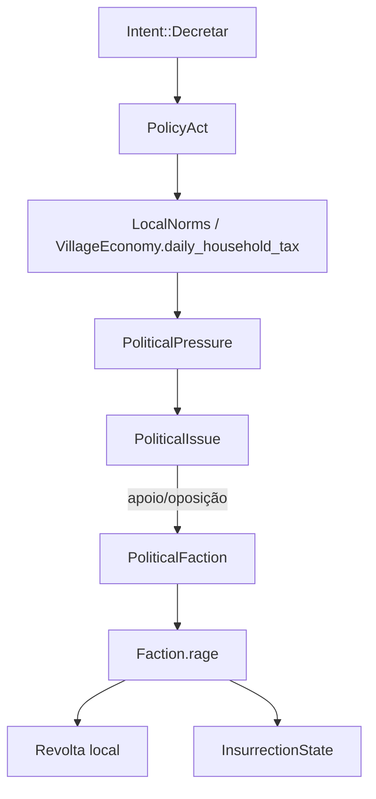

Regras importantes:

- `Apoiar`, `Opor`, `Pressionar`, `PedirApoio` e `Mediar` alteram posições, relações e pressão social.
- `Decretar(tag)` altera normas ou cria efeitos institucionais.
- Facções podem forçar mudanças indiretamente: revolta, insurreição, deposição, repressão ou guerra civil.
- Norma não muda automaticamente por maioria diária.

Expansões sistêmicas:

- Adicionar legitimidade percebida por grupo: lares pobres, produtores, guardas, comerciantes, rebeldes.
- Separar autoridade formal de autoridade real: líder pode decretar, mas enforcement e legitimidade determinam obediência.
- Decretos podem resolver uma crise e criar outra: imposto financia guerra, mas gera boicote; racionamento salva comida, mas cria ressentimento.

---

## 7. Ciclo Rebelde: Revolta Local, Insurreição e Guerra Civil

Revolta é ação física local de facção. Insurreição é coordenação política organizada. Guerra civil é o estágio macro abstrato que pode trocar controle territorial.

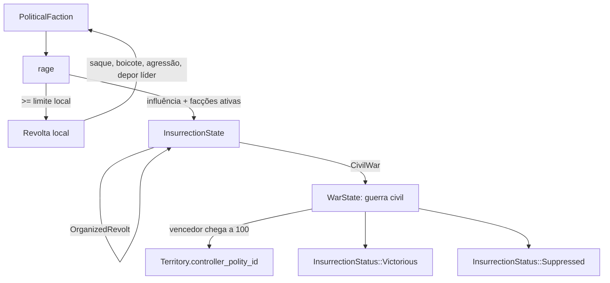

Tabela de escalada faccional:

| Estágio | Gatilho | Efeito |
| :--- | :--- | :--- |
| Descontentamento | fome, dívida, punição, guerra, decreto opressivo | gera `PoliticalPressure` |
| Facção | membros ou influência suficientes | cria `PoliticalFaction` |
| Fúria | fome/stress/trauma/ressentimento persistente | aumenta `rage` |
| Revolta local | `rage` alto e facção ativa | saque, boicote, agressão, sabotagem |
| Insurreição | várias facções ou influência alta | cria `InsurrectionState` |
| Guerra civil | apoio popular alto contra repressão | cria `WarState` interna |
| Vitória/Repressão | guerra chega a 100 ou apoio colapsa | território muda ou facção é reprimida |

---

## 8. Ciclo de Guerra Abstrata

Guerra é estatística e macro, mas seus efeitos são materiais e psicológicos. O primeiro lado que chega a 100 pontos vence automaticamente.

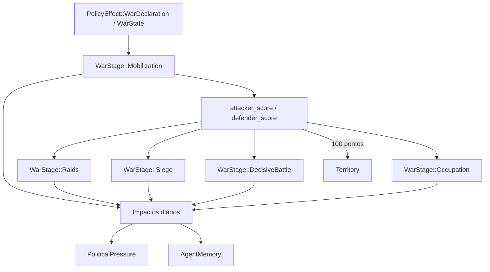

Impactos por estágio:

| Estágio | Impacto econômico | Impacto psicológico/social |
| :--- | :--- | :--- |
| `Mobilization` | custo público, demanda militar inicial | stress leve, dever cívico, medo antecipado |
| `Raids` | perda pequena de estoque, rotas inseguras | medo, rumores, ressentimento contra inimigo |
| `Siege` | escassez forte, fome, comércio prejudicado | pânico, pressão por motim, queda de legitimidade |
| `DecisiveBattle` | ferimentos/mortes estatísticas, paralisação produtiva | trauma, luto, heroísmo, desejo de vingança |
| `Occupation` | estabilidade territorial cai | resistência, colaboracionismo, insurreição |

Expansões sistêmicas:

- Guerra deve afetar preços, tarefas econômicas, segurança logística e construção defensiva.
- Guerra deve gerar narrativas subjetivas diferentes para guardas, camponeses, comerciantes e líder.
- Guerra civil deve usar a mesma mecânica de pontuação que guerra externa.

---

## 9. Ciclo Territorial e Política Externa

Território é o elo entre grid físico, economia e poder institucional.

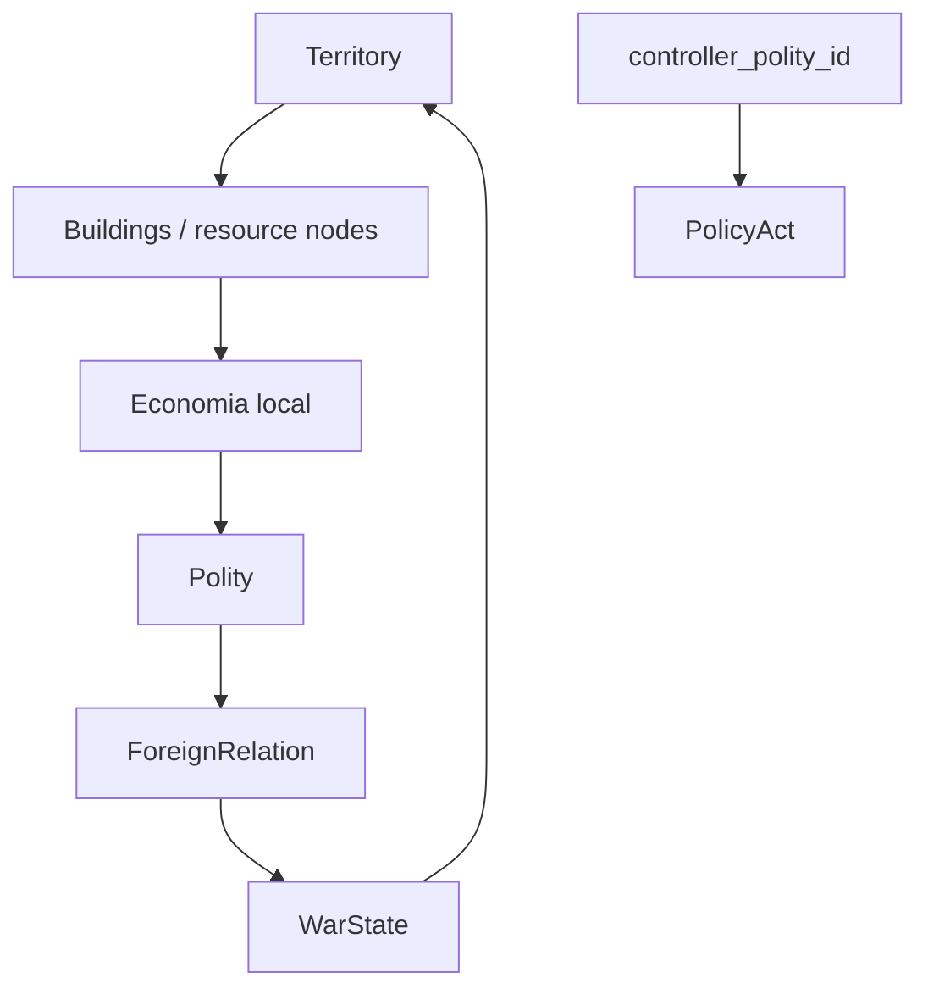

Regras atuais:

- Controle territorial não muda por pressão direta.
- Controle territorial muda após vitória em guerra externa ou guerra civil.
- Território concentra recursos, prédios e valor estratégico.
- `Polity` representa controlador político; `ForeignRelation` representa postura externa.

Expansões recomendadas:

- Territórios devem ter estabilidade, apoio local e vulnerabilidade logística.
- Construções como posto, torre, depósito e estrada devem aumentar controle/valor estratégico.
- Relações externas devem afetar comércio, embargo, tributo, medo e risco de guerra.

---

## 10. Ciclo de Construção Urbana

Construção é expansão material da vila e deve ser conectada a economia, política e território.

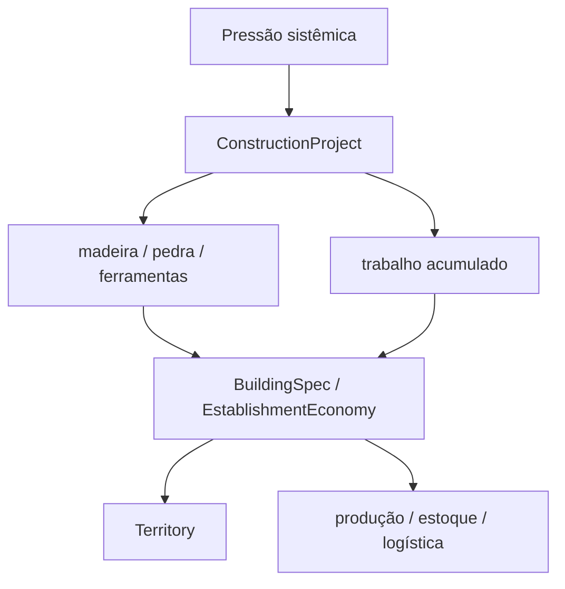

Pressões que podem gerar obras:

- falta de camas ou moradia;
- gargalo alimentar;
- falta de estoque/logística;
- necessidade de defesa territorial;
- economia clandestina;
- guerra e ocupação.

---

## 11. Ciclo de Economia Clandestina

Mercado negro é uma resposta psicológica, política e econômica a escassez ou decreto opressivo.

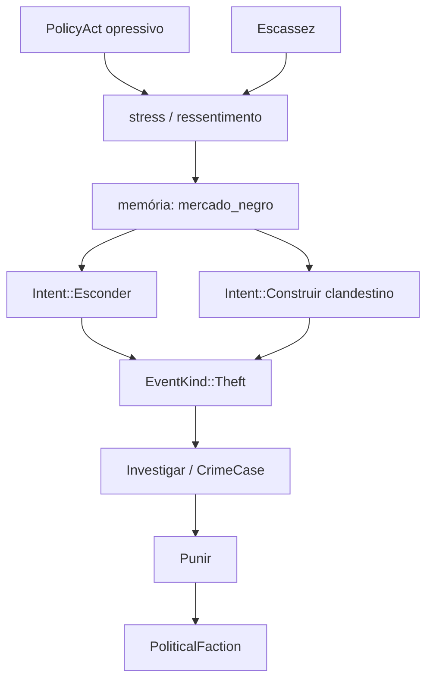

Expansões:

- Mercado negro deve ter reputação e risco próprios.
- Comprar de clandestinos pode aliviar fome, mas aumentar crime e corrupção.
- Guardas podem investigar, extorquir, reprimir ou aderir clandestinamente.

---

## 12. Tabela De Transições Críticas

| Origem | Destino | Mecanismo |
| :--- | :--- | :--- |
| `IntentKind::Decretar` | `PolicyAct` | líder cria norma/efeito institucional ativo |
| `PolicyAct` opressivo | resistência psicológica | stress, queda de confiança, memória de injustiça |
| `PoliticalPressure` | `PoliticalIssue` | pressão vira pauta visível, não muda norma sozinha |
| `PoliticalIssue` | `PoliticalFaction` | apoio/oposição alimenta coalizões |
| `PoliticalFaction.rage` | revolta local | facção ativa objetivo físico no grid |
| revolta local | `InsurrectionState` | facções ativas/influentes coordenam escalada |
| `InsurrectionState::CivilWar` | `WarState` | guerra civil abstrata por pontuação |
| `WarState` chega a 100 | `Territory.controller_polity_id` | vencedor assume território |
| `WarStage::Siege` | fome/escassez/pressão política | custo econômico e stress social diário |
| `WarStage::DecisiveBattle` | ferimentos/memórias traumáticas | dano estatístico e memória de guerra |
| punição severa | `PoliticalPressure` | ressentimento legal e facção vigilante/rebelde |
| rumor/segredo | decisão social/política | fofoca altera confiança, medo e recrutamento |
| obra concluída | território/economia | prédio material muda produção, estoque ou controle |

---

## 13. Direção De Expansão

Prioridade de expansão recomendada:

1. Aprofundar psicologia: trauma, legitimidade percebida, tensão interna e coping.
2. Aprofundar informação: rumores, propaganda, segredos e pânico coletivo.
3. Aprofundar economia de guerra: requisição, escassez militar, preços e rotas inseguras.
4. Aprofundar território: estabilidade, apoio local, construções estratégicas e ocupação.
5. Aprofundar insurreição: propaganda, repressão, adesão faccional e guerra civil.

O objetivo não é adicionar muitas intents novas. O objetivo é fazer os eventos existentes deixarem marcas persistentes que mudem memória, relação, economia, política e controle territorial ao longo do tempo.
